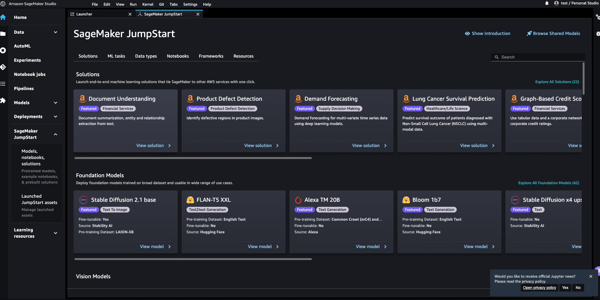
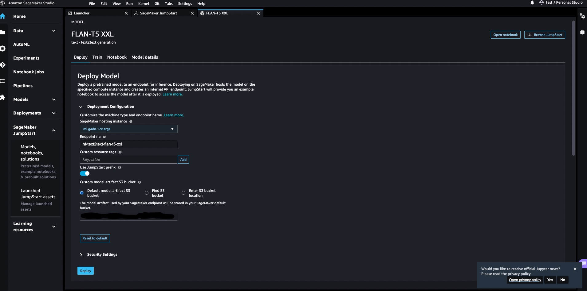
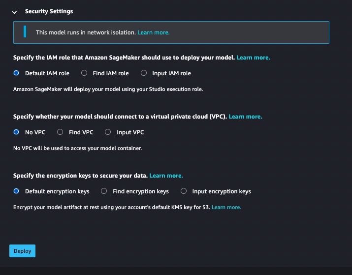
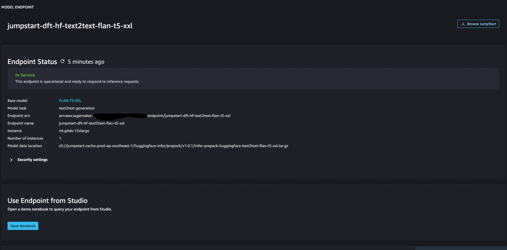
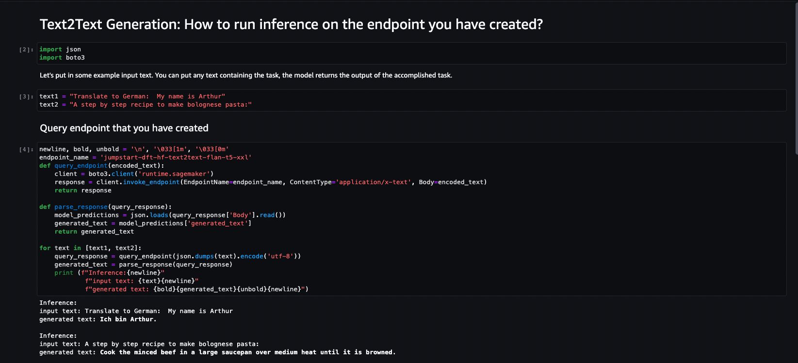

# Deploying models via SageMaker JumpStart

SageMaker JumpStart provides pretrained, open-source models for a wide range of problem types to help you get started with machine learning. As part of JumpStart, users can deploy LLMs via the GUI.

## Accessing JumpStart via SageMaker Studio

Select SageMaker JumpStart from the Launcher menu. The Launcher menu can be accessed via the Home icon. You will see the following screen. To launch a LLM, look under the section for `Foundation Models`. In this tutorial, we will launch the model called `FLAN-T5-XXL` that is a HuggingFace-based model.

## Deployment Settings 

Upon viewing the model, you can configure deployment options including instance type used. For the Singapore region, the `g4dn.12xlarge` option is the only option for the `FLAN-T5-XXL` model.

By default, the model runs in [network isolation mode](https://docs.aws.amazon.com/sagemaker/latest/dg/mkt-algo-model-internet-free.html). This means that outbound network calls are not enabled for the container running the LLM. Additional fine-grained security options are also configurable.

Hit `Deploy` to launch the model.

## Run inference with deployed model

After hitting `Deploy`, it will take a few minutes to deploy into a SageMaker Endpoint. On the backend, JumpStart creates a SageMaker Model, Endpoint Configuration and also a Real-time Inference Endpoint for the selected LLM along with the configuration options chosen. To find out more about SageMaker Real-time inference, read [here](https://docs.aws.amazon.com/sagemaker/latest/dg/realtime-endpoints.html).

Hit `Open Notebook` to directly test using the Endpoint from Sagemaker Studio. The SageMaker model is callable with the right IAM credentials that permit invocation of the SageMaker endpoint. For options to invoke via Studio, AWS SDKs or AWS CLI, read [here](https://docs.aws.amazon.com/sagemaker/latest/dg/realtime-endpoints-test-endpoints.html).

## Test inference using Jupyter Notebook

Once launching the notebook, you will see the following notebook and be able to invoke the SageMaker model (assuming the Studio IAM permissions allow for SageMaker model invocation). If you hope to run the notebook outside of Studio, you can run it [here](./notebooks/huggingface-text2text-flan-t5-xxl.ipynb).

## For more details

You can learn more about launching FLAN-T5 models on JumpStart by reading this [blog post](https://aws.amazon.com/blogs/machine-learning/zero-shot-prompting-for-the-flan-t5-foundation-model-in-amazon-sagemaker-jumpstart/).